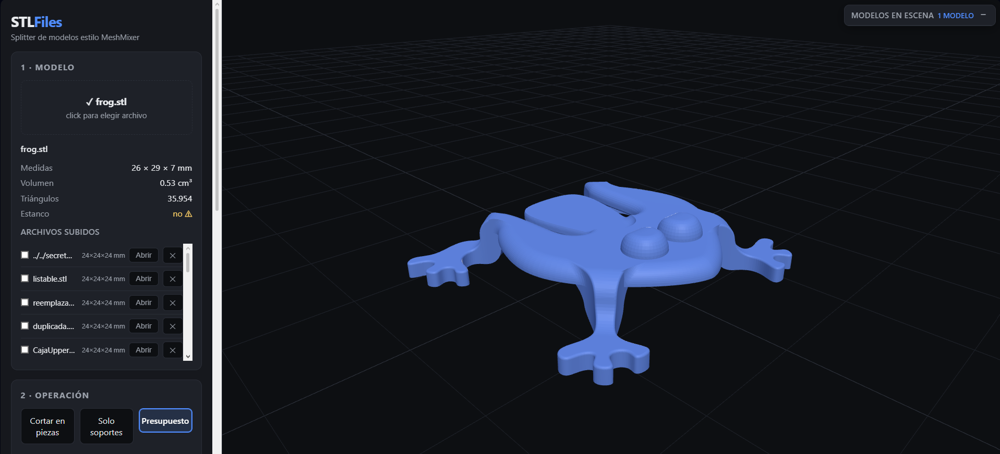
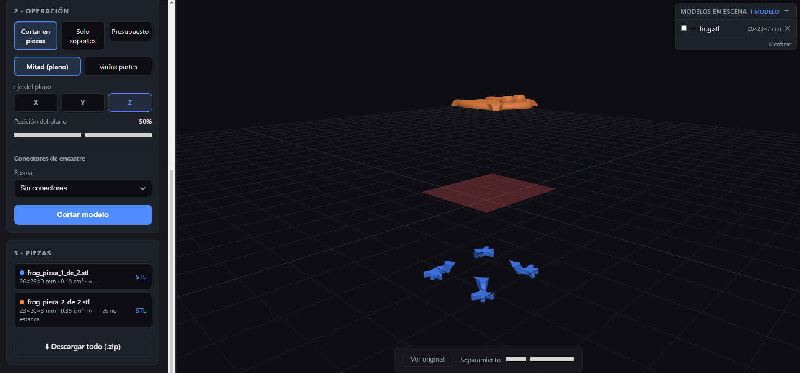

# STLFiles

MeshMixer-style 3D model splitter in the browser: upload a `.stl`, split it into parts
with a plane (or into N pieces), add press-fit connectors (cylindrical pin or
prismatic peg) and/or tree supports for minis, then download the printer-ready STLs.

## Screenshots





## Stack

- **Backend**: FastAPI + [trimesh](https://trimesh.org) with [manifold3d](https://github.com/elalish/manifold) boolean engine
- **Frontend**: plain HTML/CSS/JS + Three.js (vendored, works offline)

## Run with Docker

```bash
docker compose up --build
```

Open http://localhost:8321 — data lives in `./data` (mounted as a volume).

### Configuration (optional)

```bash
cp .env.example .env   # then edit .env to your liking
```

| Variable | Default | Purpose |
|----------|---------|---------|
| `STLFILES_PORT` | `8321` | Host port the app is published on |
| `STLFILES_DATA` | `./data` | Where uploads and jobs are stored |

## Run locally (dev)

```bash
python3 -m pip install -r requirements.txt
python3 -m uvicorn backend.main:app --reload --port 8321
```

## Usage

1. **Model**: drag-and-drop the `.stl`.
2. **Operation**:
   - *Split into parts*: plane (axis + position, with live preview) or N pieces;
     optional press-fit connectors; optional per-piece supports.
   - *Supports only*: generates tree supports over the whole model.
3. **Result**: one STL per piece, downloadable individually or all together as a ZIP.

## How the split works

| Mode | What it does |
|------|--------------|
| **Half (plane)** | Pick the X/Y/Z axis and plane position; see it live as a translucent red plane. Splits into 2 with a cap (`cap=True`), always watertight. |
| **Several parts** | Pick 2–16 parts; each piece is recursively divided along its longest axis (kd-tree), recording which pair of pieces each cut produces. |

### Connectors

Each cut generates connector sites on the cut face (grid within the usable area,
with a safety margin):

- **Pin**: cylinder protruding from one piece + hole in the other.
- **Prism**: square peg + square cavity.

Parameters: diameter/side, plug depth, clearance (the hole is enlarged by
`2 × clearance`, default `0.25 mm` tuned for FDM) and count per cut.

If a connector fails (face too small, tricky boolean), the API skips it and reports
it in `warnings` — the pieces come out the same, just without a connector on that cut.

### Supports for minis

Tree-style supports (rules R1–R10 in `docs/investigacion-soportes.md`): tapered tips
with z-gap over overhangs, columns that descend and merge, and a common base where
they reach the build bed. Parameters: overhang angle, tip/contact diameters,
spacing, z-gap and base thickness.

If an overhang has material beneath it (part of the model), the column rests on it
instead of going all the way down to the base.

## API

| Endpoint | Description |
|----------|-------------|
| `POST /api/models` | Upload STL (multipart) → info: dimensions, volume, triangles |
| `GET /api/models/{id}/file` | Original STL |
| `GET /api/models/{id}/preview` | Decimated STL for the viewer (cached) |
| `GET /api/models/{id}/suggest-connector` | Pin suggestion based on the cut face |
| `POST /api/models/{id}/supports` | Supports over the whole model → 1-piece job |
| `POST /api/cut` | Split (+ optional connectors/supports) → job with pieces, splits and warnings |
| `GET /api/jobs/{job}/pieces/{i}` | STL of one piece |
| `GET /api/jobs/{job}/pieces/{i}/preview` | Decimated preview of one piece |
| `GET /api/jobs/{job}/zip` | ZIP with the pieces + `{cut\|supports}_info.json` |

## Tests

```bash
python3 -m pytest tests/ -q
```

## Structure

```
backend/
  main.py        FastAPI: upload, split, supports, downloads, static
  mesh_ops.py    loading, info, plane split, recursive split, previews
  connectors.py  connector sites + pin/prism primitives + booleans
  supports.py    overhang detection + support tree + common base
web/             index.html, style.css, js/ (ES modules), vendor/ (local three.js)
tests/           pytest for the split engine, connectors, supports and API
samples/         example STLs for testing
docs/            support research and rules
problemas/       bug log: one md per resolved bug
data/            uploads and jobs (gitignored)
```

More technical detail for contributors: [`AGENTS.md`](AGENTS.md).